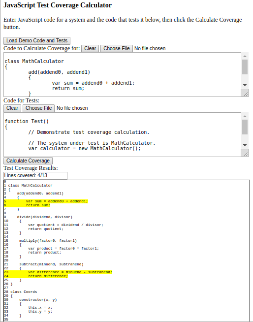

JavaScript Test Coverage Calculator
===================================

A rudimentary program to calculate the amount of JavaScript code covered by automated tests.

To run, open the file Source/JavaScriptTestCoverageCalculator.html in a web browser that runs JavaScript.  Some demo files are provided in the Data directory.  The same demo data can also be loaded by pressing the "Load Demo Code and Tests" button at the top of the user interface.  Once code and tests have been specified, the "Calculate Coverage" button can be clicked to calculate test coverage.

As it stands, this repository is mostly intended as a basis for further work.  Right now, the program only handles very simple programs that follow a particular (and frankly, idiosyncratic) coding standard.  It will probably eventually be expanded to support loading code and Tests via uploading a .tar file.

</img>
